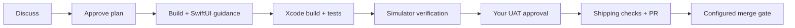

<p align="center"></p>

# iOS Foundry

**Your all-in-one agent workflow for building, testing, and shipping iOS apps.**

Bring a repeatable development process to Codex: scoped planning, modern SwiftUI
guidance, Xcode MCP builds and tests, real simulator interactions, and human
acceptance before shipping. Created by Phillip Dougherty from his daily workflow.

[](LICENSE)
[](#requirements)
[](#whats-included)

## Quick start

Clone this repository, then run:

```sh
git clone https://github.com/pb-crackers/ios-foundry.git
cd ios-foundry
sh install.sh --install-tools
python3 scripts/setup.py doctor --probe-mcp
```

The installer copies skills into `~/.agents/skills`, installs missing Codex
through npm (and Node through an existing Homebrew installation when needed),
and configures `xcrun mcpbridge`. Existing skills or MCP settings that differ
are preserved, and setup reports the conflict. No personal configuration is
imported. You still approve Xcode access and sign in to your agent yourself.

For a project-only installation:

```sh
sh install.sh --project /path/to/MyApp --install-tools
```

That creates `.agents/skills` and a small `.ios-foundry.json` in your project.
Commit those files if your team should share the workflow. User-wide installation
does not change any app project.

**Xcode setup:** enable external agent access in Xcode Settings → Intelligence,
open your project, and approve the intended agent/project folder when prompted.
Read the [Xcode setup guide](skills/xcode-device-interaction/references/setup.md)
for the background-server option and permission troubleshooting.

Restart your agent if newly installed skills do not appear, then try:

```text
Use $dev-workflow to discuss adding an empty state to my app.
Use $debug-feature to investigate this navigation bug.
Use $xcode-device-interaction to verify the app's onboarding flow.
```

The parent workflow loads phase and supporting skills as needed. Direct phase
requests still need the relevant task record and approval state.

## What happens



You approve scope and the implementation plan. The agent builds the candidate,
tests the relevant behavior, exercises changed screens, and preserves evidence.
It leaves a dedicated simulator ready for your user acceptance testing (UAT).
After approval, it runs project shipping checks and prepares a pull request.
Automatic merging is opt-in. App Store release and deployment require separate
authorization. A screenshot or successful build does not replace your approval.

## What's included

| Skill | Job |
| --- | --- |
| `dev-workflow` | Routes the task and keeps its decisions, status, and evidence |
| `capture-todo` | Records a named idea or bug |
| `discuss-feature` | Defines scope, success criteria, and visual states |
| `debug-feature` | Finds the root cause and proposes a fix |
| `plan-feature` | Maps criteria to implementation and validation |
| `build-feature` | Implements, reviews, builds, tests, and verifies |
| `uat-feature` | Presents the running candidate for your acceptance |
| `ship-feature` | Runs shipping gates and prepares the PR/merge |
| `xcode-device-interaction` | Uses Xcode MCP for runtime checks and evidence |
| `swiftui-expert-skill` | State, layout, current APIs, accessibility, and Instruments |
| `swiftui-pro` | Focused SwiftUI code review |
| `ponytail` | Prefers the smallest correct implementation |

The SwiftUI and Ponytail skills are attributed MIT dependencies. The bundled
Ponytail skill is loaded by the workflow; it does not install Ponytail's separate
persistent plugin hooks. See [third-party notices](THIRD_PARTY_NOTICES.md).

## Requirements

- macOS with full Xcode, accepted Apple terms, and a compatible iOS simulator runtime.
- Python 3.10+, Git, and Codex. `--install-tools` can install missing Codex/Node;
  install Xcode separately if absent. With Homebrew installed, `--install-tools`
  also installs missing Python and GitHub CLI.
- Xcode MCP with build/test tools; interactive validation additionally requires
  the DeviceInteraction tools. This integration targets the Xcode 27 tool schema.
  Older compatible Xcode builds may support only a subset; doctor checks tools.
- Your own agent account. GitHub CLI (`gh`) and GitHub sign-in are needed for
  automated PR shipping, not local implementation or simulator checks.

Xcode supplies the MCP server. The package configures its bridge; it doesn't
ship Xcode binaries or bypass its permissions. Beta API references are guidance,
not a reason to raise your deployment target; verify availability in your SDK.

## Setup controls

```sh
sh install.sh --dry-run                    # inspect without changing settings
sh install.sh --skip-mcp                   # copy skills only
sh install.sh --download-runtime           # request Apple's large iOS runtime download
python3 scripts/setup.py doctor           # check prerequisites and configuration
python3 scripts/setup.py doctor --probe-mcp # also make a read-only Xcode call
python3 scripts/setup.py uninstall        # remove only unchanged installer-owned copies
```

Add `--project /path/to/MyApp` to doctor or uninstall for a project installation.
Use `--skills-dir /another/location` for an isolated custom installation.
The installer never overwrites differing skills. To update, uninstall unchanged
copies, pull the new release, and install again. Modified copies require manual
reconciliation. Uninstall retains MCP configuration and your task records.

Default records live under `docs/workflow` in the app repository. Copy
[the config example](examples/ios-foundry.json) to your app's `.ios-foundry.json`
to change storage or explicitly enable `auto_merge`. An external records path
can point at an Obsidian vault; Obsidian and iCloud are optional.

## Plugin distribution

This repo also contains a portable `plugin.json`, bundled `mcp.json`, and a
marketplace catalog. Add the local checkout with
`codex plugin marketplace add /path/to/ios-foundry`, then install it through the
host's plugin interface. Follow [official plugin instructions](https://developers.openai.com/plugins/build/plugins).
Choose either plugin installation or direct skill copies to avoid duplicate
skills and Xcode connections. The direct installer is the tested setup path;
plugin loading still needs verification in your installed host version.

## Verification and contributions

```sh
python3 tests/check_setup.py
python3 scripts/validate.py
```

These check conflict handling, repeat installation, safe uninstall, metadata,
and skill reference integrity. Follow the [live smoke-test guide](docs/smoke-test.md)
to validate an actual app. Package checks do not prove any particular app works.

Contributions should keep the workflow portable, preserve user work, and include
a runnable check for changes to setup logic. See [CONTRIBUTING.md](CONTRIBUTING.md).

## License

Original workflow, tooling, and documentation: **Apache License 2.0**.
Bundled third-party skills retain **MIT** licenses. Apple software and locally
exported Apple skills remain subject to Apple's terms. This is an independent
project, not affiliated with Apple, OpenAI, or the third-party skill authors.
